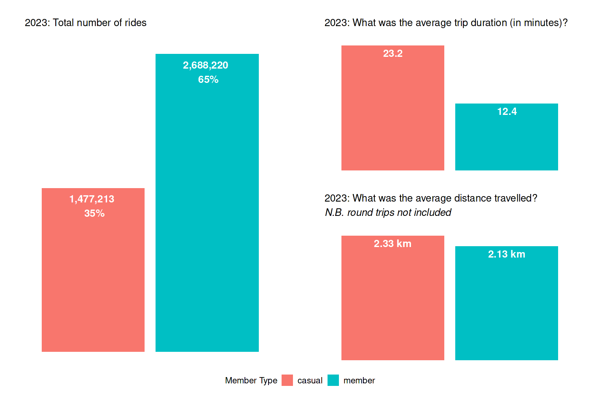

Cyclistic 2023 | Data Analysis
================
Lucio Colonna
<br>Last updated: Tuesday September 10, 2024

<br>

[⬅️ **Back to Index**](./README.md)

<br>

# Summary

<span style="color: #0047AB;">📌 <strong>Overview of
2023</strong></span>

- Total rides count, average ride duration and average trip distance for
  each member group [throughout 2023](#1-overview-of-2023)
- [Total cycling minutes](#11-total-minutes-spent-cycling): sum of the
  total minutes spent cycling for each member group throughout the
  entire year
- [Round trips](#12-round-trips): analysis of round trips made by riders
  in terms of ride count and average duration

<hr style="border: none; border-top: 1px solid #ccc; margin: 25px 0;">

<span style="color: #0047AB;">📌 <strong>By Ride
Duration</strong></span>

- Analysis of ride duration [quartiles](#2-by-ride-duration) (overall
  and by member group)
- [All Trips](#21-all-trips): analysis of the duration of all trips,
  divided into **1-hour** bins
- [Up to 60 Minutes](#22-up-to-60-minutes): focus on trips lasting **up
  to 60 minutes**, that constitute **~97% of all rides**

<hr style="border: none; border-top: 1px solid #ccc; margin: 25px 0;">

<span style="color: #0047AB;">📌 <strong>By Distance</strong></span>

- Analysis of trips distance [quartiles](#3-by-distance) (overall and by
  member group)
- [All Trips](#31-all-trips): analysis of all trips based on distance,
  divided into **1-km** bins
- [Up to 10 km](#32-up-to-10-km): focus on trips covering distances **up
  to 10 kilometers**, which account for approximately **~99% of all
  rides** (excluding round trips as they have 0 km distance; otherwise,
  it would be approximately **95%**)
- Analysis of relationship between [trip distance and ride
  duration](#33-vs-ride-duration)

<hr style="border: none; border-top: 1px solid #ccc; margin: 25px 0;">

<span style="color: #0047AB;">📌 <strong>By Quarter</strong></span>

- Analysis of cycling trips on a [quarterly basis](#4-by-quarter)

<hr style="border: none; border-top: 1px solid #ccc; margin: 25px 0;">

<span style="color: #0047AB;">📌 <strong>By Month</strong></span>

- Analysis of the distribution of rides [by month](#5-by-month)
- [VS weather conditions](#51-vs-weather-conditions): examination of
  monthly cycling trips in relation to **weather conditions** of Chicago
  in 2023 (avg. temperature, avg. precipitations)
- [VS ride duration](#52-vs-ride-duration): comparison of monthly
  cycling trips with average ride duration

<hr style="border: none; border-top: 1px solid #ccc; margin: 25px 0;">

<span style="color: #0047AB;">📌 <strong>By Day of the
Week</strong></span>

- Analysis of the distribution of rides [by day of the
  week](#6-by-day-of-the-week)
- [Weekdays vs Weekends](#61-weekdays-vs-weekends): comparison of
  cycling patterns between weekdays and weekends
- [VS ride duration](#62-vs-ride-duration): comparison of rides with
  average ride duration for each day of the week

<hr style="border: none; border-top: 1px solid #ccc; margin: 25px 0;">

<span style="color: #0047AB;">📌 <strong>By Hour</strong></span>

- Analysis of the distribution of rides [by hour of the
  day](#7-by-hour), with identification of **peak usage times**
- [VS ride duration](#71-vs-ride-duration): examination of cycling trips
  by hour in relation to ride duration

<hr style="border: none; border-top: 1px solid #ccc; margin: 25px 0;">

<span style="color: #0047AB;">📌 <strong>Heatmaps</strong></span>

- Creation of [heatmaps](#8-heatmaps) to visualize cycling data across
  the following temporal dimensions:

  - Month VS Day of the week
  - Day of the Week VS Hour of the day
  - Month VS Hour of the day

<hr style="border: none; border-top: 1px solid #ccc; margin: 25px 0;">

<span style="color: #0047AB;">📌 <strong>By Bike type</strong></span>

- Analyze [bike type usage](#9-by-bike-type) between the member groups
- [Weekdays vs. Weekends](#91-vs-weekdaysweekends): analyze bike types
  usage differences between weekdays and weekends
- [VS distance](#92-vs-distance): examine average trip distances by bike
  type
- [VS speed](#93-vs-speed): Assess the relationship between bike types
  and average trip speeds

<hr style="border: none; border-top: 1px solid #ccc; margin: 25px 0;">

<span style="color: #0047AB;">📌 <strong>By Station</strong></span>

- Analyze the [geographical distribution and usage rate of start
  stations](#101-geographical-distribution-and-usage), regardless of
  whether the rides pertain to casual or member users, to identify areas
  with low, moderate, and high ride density in the city
- Identification of the [top 20 most frequently used start and end
  stations](#102-top-start-and-end-stations) for both member groups
- Analysis of the [top 20 most popular routes](#103-top-routes) for both
  casual and member
- Analysis of start stations [predominantly used by casual users or
  members](#104-user-predominance) beyond defined thresholds
- Identification and examination of the [most used
  stations](#105-most-used-stations-start-or-end), whether as starting
  or ending points

<br>

## 1. Overview of 2023

<br>

[⬅️ **Back to Summary**](#summary)

<br>

The first step in our analysis is to gather useful data for the entire
year of 2023. Specifically, I will retrieve data for both members and
casual users, focusing on:

- Total number of rides
- Average ride duration
- Average distance travelled

For the average distance travelled, I will exclude round trips, as their
distance is 0 and could compromise the results: 

<br>

<p align="center">
  
</p>

<br>

> Key findings:
>
> - **Members** account for a larger proportion of total rides (**65%**)
>   compared to casual users (**35%**). This is a positive sign for the
>   company, as members are considered more profitable
> - **Members** prefer **shorter, more frequent rides** (which is
>   typical for a subscription-based model), while **casual** users tend
>   to have **longer ride durations**
> - **Casual** users show **longer trip durations** and **slightly
>   greater distances**. This could be due to casual users being more
>   likely to use the bikes for leisurely activities, while members
>   might use them for quick, practical commutes

<br>

------------------------------------------------------------------------

<br>

### 1.1 Total minutes spent cycling

<br>

[⬅️ **Back to Summary**](#summary)

<br>

<p align="center">
  
</p>

<br>

> Key findings:
>
> - Despite members having more rides (as shown in the previous data),
>   casual users collectively spent more time on bikes. This indicates
>   that **casual** users tend to take **longer trips** compared to
>   members
> - **Members**, while having a lower total time spent compared to
>   casual users, may be using the service **more efficiently** for
>   **shorter** and **more frequent trips**, likely for **commuting**
>   purposes

<br>

------------------------------------------------------------------------

<br>

### 1.2 Round trips

<br>

[⬅️ **Back to Summary**](#summary)

<br>

<p align="center">
  
</p>

<br>

> Key findings:
>
> - **Casual** users make a larger proportion of their rides as **round
>   trips** (**8%**) compared to **members** (**3%**). This might
>   suggest that casual users are more likely to use the service for
>   leisure or sightseeing, where they return to their starting point
> - The **average duration** of round trips for **casual** users is
>   **significantly longer** (**44.24 minutes**) than for **members**
>   (**23.31 minutes**). This aligns with the intuition that casual
>   users generally take longer trips
> - **Members** tend to have **shorter round trips**, which might
>   indicate that their usage is more **practical** and
>   **time-efficient**, possibly for commuting or running quick errands

<br>

<div style="border-bottom: 3px solid #1ABDFF; color: #1ABDFF;">

</div>

<br>

## 2. By Ride Duration

<br>

[⬅️ **Back to Summary**](#summary)

<br>

<!-- In order to deeply analyze the ride duration of trips, I will first calculate the **quartiles** of the duration in minutes for all data and then separately for both members and casual users: -->

    ## Quartiles of duration_minutes (ALL DATA):

    ##   Q    %   Value
    ##  Q0   0%    1.00
    ##  Q1  25%    5.83
    ##  Q2  50%   10.00
    ##  Q3  75%   17.73
    ##  Q4 100% 1439.87

    ## Quartiles of duration_minutes (CASUAL):

    ##   Q    %   Value
    ##  Q0   0%    1.00
    ##  Q1  25%    7.42
    ##  Q2  50%   13.00
    ##  Q3  75%   24.43
    ##  Q4 100% 1437.68

    ## Quartiles of duration_minutes (MEMBER):

    ##   Q    %   Value
    ##  Q0   0%    1.00
    ##  Q1  25%    5.25
    ##  Q2  50%    8.78
    ##  Q3  75%   14.90
    ##  Q4 100% 1439.87

<br>

> Key findings:
>
> - 50% of all rides lasted **10 minutes or less**
> - The **median** duration for **casual users (13.00 minutes)** is
>   notably **higher** than that of **members (8.78 minutes)**
> - The trip **durations** for casual users are more **spread out**,
>   with the **Q3 at 24.43 minutes**, compared to **14.90 minutes** for
>   **members**
> - The **maximum trip durations are similar** across both casual and
>   members, indicating that there are some very long trips taken by
>   both, but they do not significantly impact the overall distribution
>
> Overall, the data above reaffirms the previous observations:
> **casual** users tend to have **longer trip durations** while
> **members** have **shorter, more frequent trips**.

<!-- I now want to analyze more in depth the duration of trips. To do so, I intend to divide the data into manageable intervals, hoping I can gain insights into how rides are distributed. -->

<br>

------------------------------------------------------------------------

<br>

### 2.1 All trips

<br>

[⬅️ **Back to Summary**](#summary)

<br>

I will start dividing the data into **1-hour intervals**.

<!-- To achieve this, I'm utilizing the ```cut``` function, through which I'll partition the data into intervals in the format of $(n, n+1]$ hours: -->

<br>

<!-- Next, I'll generate a density plot illustrating the duration of rides (I will apply a filter on ```duration_minutes``` to improve readibility): -->

<p align="center">
  
</p>

<br>

> Key findings:
>
> - Rides lasting up to 60 minutes constitute the vast majority,
>   comprising ~97.25% of all rides (more than 4 mil. recorded
>   instances)
> - As the **duration increases**, the number of rides **decreases
>   significantly**: only 2.75% of rides lasted more than 1 hour
> - Overall, the data shows a **skewed distribution**, with the majority
>   of rides being relatively short in duration, while longer rides are
>   less frequent

<br>

------------------------------------------------------------------------

<br>

### 2.2 Up to 60 minutes

<br>

[⬅️ **Back to Summary**](#summary)

<br>

Now let’s “zoom in” on the rides that lasted between 1 and 60 minutes,
that constiute **~97% of all rides**.

<!-- I am going to use the same approach as before, but this time I am slicing the data in intervals of $[n, n+1)$ minutes, considering that 1 is the minimum duration: -->

<br>

<!-- Now, let's plot a bar chart to visualize the duration from 1 to 60 minutes according to the intervals defined above, **overlaying** the observations of members and casual riders: -->

<p align="center">
  
</p>

<br>

> Key findings:
>
> **Casual**:
>
> - 1 to 7 minutes: there is a **progressive increase** in the number of
>   rides
> - 6 to 7 minutes: **peak usage** with **79,910** rides that account
>   for **5.40%** of the total casual rides
> - 7 minutes onward: the rides count begins to drop with the percentage
>   of total rides decreasing consistently in each interval
>
> **Members**:
>
> - 1 to 5 minutes: There is a consistent increase in the number of
>   rides.
> - 5 to 6 minutes: **peak usage** with **219,381** rides that account
>   for **8.16%** of the total member rides
> - 6 minutes onward: as for casual, a continuous decline in ride count
>   is observed, with percentages decreasing gradually
> - For members specifically, it is important to highlight that
>   according to the [**company’s pricing
>   policy**](https://divvybikes.com/pricing), the **first 45 minutes
>   are free**, after which a **per-minute fee is applied**. This
>   reinforces the concept that there is a decline in the number of
>   rides as the duration increases
>
> **Overall**:
>
> - Casual users and members both exhibit peak usage at different points
>   within their respective durations. Casual users peak slightly later,
>   between **6 to 7 minutes**, while members peak earlier, between **4
>   to 5 minutes**
> - After their respective peaks, both groups show a **steady decline**
>   in the number of rides, indicating **shorter trips are more
>   common**, and as **trip duration increases**, the **frequency of
>   such trips decreases**

<br>

<!-- Before moving on to the next section, I will remove the columns that were temporarily added for the analysis: -->

<br>

<div style="border-bottom: 3px solid #1ABDFF; color: #1ABDFF;">

</div>

<br>

## 3. By Distance

<br>

[⬅️ **Back to Summary**](#summary)

To analyze the distance, I will use the same methodology applied in the
previous section. However, there are two important points to keep in
mind:

- The calculated distances are **approximate** and represent the
  **straight-line distance** between the start and end stations. This is
  because the dataset does not include information about the actual
  distance covered via GPS
- **Round trips** have a **distance equal to 0** (since the start
  station is the same as the end station) and therefore have been
  **filtered out** in this analysis to avoid compromising the results

<!-- -->

    ## Quartiles of trip_distance_km (ALL DATA):

    ##   Q    %        Value
    ##  Q0   0%  0.001097435
    ##  Q1  25%  0.992675068
    ##  Q2  50%  1.620618606
    ##  Q3  75%  2.800075894
    ##  Q4 100% 33.046086828

    ## Quartiles of trip_distance_km (CASUAL):

    ##   Q    %        Value
    ##  Q0   0%  0.004716732
    ##  Q1  25%  1.105682750
    ##  Q2  50%  1.750670512
    ##  Q3  75%  2.898277487
    ##  Q4 100% 33.046086828

    ## Quartiles of trip_distance_km (MEMBER):

    ##   Q    %        Value
    ##  Q0   0%  0.001097435
    ##  Q1  25%  0.930068793
    ##  Q2  50%  1.545681154
    ##  Q3  75%  2.731385298
    ##  Q4 100% 25.595266290

<br>

> Key findings:
>
> - The overall quartiles indicate that **most trips are relatively
>   short**, with the median trip distance being around 1.6 km.
>   **Casual** users tend to have **slightly longer trip distances**
>   compared to members
> - The median (Q2) and 75th percentile (Q3) values for casual users are
>   also higher, indicating a tendency for casual users to engage in
>   longer trips
> - In short, **casual** users typically take **longer trips** than
>   members. This aligns with the observation that casual users often
>   use the service for leisure or recreational purposes, while members
>   might use it more for commuting and shorter, frequent trips

<br>

------------------------------------------------------------------------

<br>

### 3.1 All trips

<br>

[⬅️ **Back to Summary**](#summary)

<br>

This time I will divide the data into **1-km intervals**.

<!-- To achieve this, I'm utilizing the ```cut``` function, through which I'll partition the data into intervals in the format of $(n,n+1]$ km: -->
<!-- Now I'll generate a density plot illustrating the distance in km of rides (I will apply a filter on ```trip_distance_km``` to improve readibility): -->

<br>

<p align="center">
  
</p>

<br>

> Key findings:
>
> - The majority of trips are short, with **60.37% of trips** being
>   **under 2 km**
> - **As the distance increases**, the **frequency of trips decreases**.
>   For example, trips between 2 to 3 km account for ~17.4%, and trips
>   between 3 to 4 km make up ~9.0%. This trend continues with smaller
>   percentages for longer distances
> - There is a **long tail** in the distribution indicating that while
>   most trips are short, there are some longer trips. The **percentage
>   of trips** continues to **decrease for distances beyond 5 km**
> - In short, the data indicates that the **bike-sharing** service is
>   predominantly used for **short-distance trips**, with a significant
>   drop-off in the number of longer trips. This pattern is **typical
>   for urban bike-sharing schemes** where users prefer bikes for short
>   commutes or quick errands

<br>

------------------------------------------------------------------------

<br>

### 3.2 Up to 10 km

<br>

[⬅️ **Back to Summary**](#summary)

<br>

Similarly to what done before, let’s now focus on the distances **lower
than 10 km**, that constitute ~99% of all rides (round trips not
included): <br>

<p align="center">
  
</p>

<br>

> Key findings:
>
> - **Both casual and members** have the **highest number of trips** in
>   the **1 to 2 km** range.
> - **Members** show a **steeper decline** in trip counts after the 1 to
>   2 km range, suggesting a stronger **preference for short trips**
> - The counts for trips **beyond 2 km** decrease significantly for both
>   groups

<br>

<!-- Again, before moving on to the next section, I will remove the column that were temporarily added for the analysis: -->

<br>

------------------------------------------------------------------------

<br>

### 3.3 VS ride duration

<br>

[⬅️ **Back to Summary**](#summary)

<br>

<p align="center">
  
</p>

<br>

> Key findings:
>
> - **Both user groups** predominantly take **short trips** in terms of
>   **distance and duration**, as indicated by the clustering of the
>   majority of trips in the lower left quadrant of the plot
> - **Casual** users show a **wider spread** in trip durations and
>   distances compared to members. This suggests that casual users are
>   more likely to take both very short and very long trips
> - **Members** tend to have **more consistent trip patterns** with
>   shorter durations and distances

<br>

------------------------------------------------------------------------

<br>

## 4. By Quarter

<br>

[⬅️ **Back to Summary**](#summary)

<br>

<!-- Let's break down the ride count by quarter and member groups: -->

<p align="center">
  
</p>

<br>

> Key findings:
>
> - Both user groups show **seasonal variation** with an **increased
>   activity** in the **warmer months** (second and third quarters), and
>   a peak in the third quarter
> - The **first** and **fourth** quarters have the **lowest ride
>   counts** for both groups, likely due to less favorable **weather
>   conditions**
> - The **gap** between members and casual users fluctuates over time,
>   being **widest in the first quarter**

<br>

<div style="border-bottom: 3px solid #1ABDFF; color: #1ABDFF;">

</div>

<br>

## 5. By Month

<br>

[⬅️ **Back to Summary**](#summary)

<br>

<!-- Let's break down the ride count by month and member groups: -->

<p align="center">
  
</p>

<br>

> Key findings:
>
> - both user groups show a clear **seasonal pattern**, with trip
>   numbers increasing in the **warmer months (April to September)** and
>   decreasing in the **colder months (October to March)**
> - the **peak month** for members is August while for casual users it
>   is July
> - the lowest trip counts occur in the **winter months** (January,
>   February, December), reflecting reduced activity likely due to less
>   favorable weather conditions

<br>

------------------------------------------------------------------------

<br>

### 5.1 VS weather conditions

<br>

[⬅️ **Back to Summary**](#summary)

<br>

<!-- Previosuly we've hypothesized that there might be a seasonal trend in bike-sharing likely influenced by **weather conditions**. Now, let's see if we can provide a "scientific" basis for this assumption. 
&#10;To do this, I intend to correlate the monthly ride data with the **monthly average temperatures** and the **monthly average precipitations** recorded in Chicago in 2023. -->
<!-- Starting from the source dataframes, I am first converting "Farenheit" to "Celsius" (for temperature) and "inches" to "cm" (for precipitations). Then, I will merge them with the ```df_summary_month``` by using the ```left_join``` function: -->

<p align="center">
  
</p>

<br>

------------------------------------------------------------------------

<br>

Let’s see if the variables are correlated:

    ## $casual
    ## $casual$temp_correlation
    ## [1] 0.994
    ## 
    ## $casual$prcp_correlation
    ## [1] 0.128
    ## 
    ## 
    ## $member
    ## $member$temp_correlation
    ## [1] 0.984
    ## 
    ## $member$prcp_correlation
    ## [1] 0.001

<br>

> Key findings:
>
> Correlation with **avg. temperatures**:
>
> - The coefficients of **0.994** and **0.984** for respectively
>   **casual** and **member** riders suggests a **very strong positive
>   correlation** between the average temperature and the number of
>   rides per month
> - This indicates that **as the temperature increases**, there is a
>   significant **increase in the number of bike rides taken**. It
>   aligns with the intuitive understanding that warmer weather tends to
>   encourage outdoor activities like biking
>
> Correlation with **avg. precipitations**:
>
> - The coefficients of **0.127** and **0.001** for respectively
>   **casual** and **member** riders indicates that **precipitations**
>   have a **minimal influence** on the number of rides taken
> - For members specifically, the correlation is essentially zero,
>   implying that precipitation has virtually **no impact** on their
>   ride count

<br>

------------------------------------------------------------------------

<br>

### 5.2 VS ride duration

<br>

[⬅️ **Back to Summary**](#summary)

<br>

<!-- Let's now explore the average ride duration by month for both groups: -->

<p align="center">
  
</p>

<br>

> Key findings::
>
> - Both casual users and members show **increased average ride
>   durations** during the warmer months (April to September) due to (we
>   can definitely say it now 😃) more favorable weather conditions for
>   biking
> - **Members** show a more **consistent average ride duration** across
>   all months, suggesting a pattern of regular and shorter trips,
>   likely for commuting or routine errands

<br>

------------------------------------------------------------------------

<!-- Let's now plot a combo chart using function ```plot_rides_vs_duration``` and see if there is a correlation between the variables monthly ride count and monthyl avg. duration. -->
<!-- Please note that I am going to perform this same type of analysis later on as well with other time variables (day of the week, hour of the day) -->

<br>

<p align="center">
  
</p>

<br>

Let’s find out if there is a correlation between number of rides and
average duration of trips for both groups:

<br>

    ## $casual
    ## [1] 0.947
    ## 
    ## $member
    ## [1] 0.958

<br>

> Key findings:
>
> - These results indicate a **strong positive correlation** between
>   **monthly ride counts** and average **ride duration** for both user
>   groups
> - It suggests that as the **number of rides per month increases**, so
>   does the **average duration** of those rides for both casual users
>   and members

<br>

<div style="border-bottom: 3px solid #1ABDFF; color: #1ABDFF;">

</div>

<br>

## 6. By Day of the Week

<br>

[⬅️ **Back to Summary**](#summary)

<!-- Let's proceed with the analysis on single days of the week: -->

<br>

<p align="center">
  
</p>

<br>

> Key findings:
>
> Casual:
>
> - The number of trips taken by **casual** users **increases**
>   progressively **from Monday to Friday**
> - There is a substantial **rise** in the number of trips **on
>   weekends**, with the highest number on **Saturday (298,913 trips)**,
>   followed by **Sunday (245,400 trips)**. This reaffirms that casual
>   users are **more active on weekends**, likely using the service for
>   leisure and recreational activities
>
> Members:
>
> - Members show a **more consistent usage pattern** throughout the
>   week, with the highest numbers of trips occurring on **Tuesday,
>   Wednesday, and Thursday**, each surpassing 430,000 trips
> - There is a **slight decline** in the number of trips **on Friday**
>   (384,585 trips) compared to midweek, but still relatively high.
> - On weekends, while the number of trips decreases, it **remains
>   significant**, with Saturday (335,650 trips) and Sunday (295,278
>   trips) indicating that members still use the service considerably
>   outside of the workweek

<br>

------------------------------------------------------------------------

<br>

### 6.1 Weekdays vs Weekends

<br>

[⬅️ **Back to Summary**](#summary)

<br>

<!-- In this section, I will analyze the ride counts and average durations, comparing weekdays versus weekends: -->

<p align="center">
  
</p>

<br>

> Key findings:
>
> - **Members** predominantly use bikes during **weekdays** (77%),
>   indicating that they likely use the service for **commuting and
>   daily routines**
> - Casual users, however, have a **slightly balanced usage** between
>   weekdays (63%) and weekends (37%), suggesting a mix of **practical**
>   and **leisure** use
> - Both casual users and members tend to have **longer trips on
>   weekends** compared to weekdays
> - **Casual** users have significantly **longer average trip durations
>   on weekends** (**26.6 minutes**) than on weekdays (21.28 minutes),
>   which could be due to more leisure and recreational activities
> - **Members** also take **longer trips on weekends** (13.88 minutes)
>   than on weekdays (11.89 minutes), but the **increase is less
>   pronounced** compared to casual users

<br>

------------------------------------------------------------------------

<br>

### 6.2 VS ride duration

<br>

[⬅️ **Back to Summary**](#summary)

<br>

<!-- Now let'sanalyze the average ride duration of trips for each day of the week, broken down by user groups: -->

<p align="center">
  
</p>

<br>

> Key findings:
>
> - **Casual** users have **longer average ride durations** compared to
>   members, particularly on weekends. Specifically, casual users have
>   longer rides on **Saturdays** (**26.26 minutes**) and **Sundays**
>   (**27.01 minutes**) compared to weekdays
> - In contrast, **members** show more **consistent ride durations
>   across the week**, with slightly longer averages on Fridays (12.25
>   minutes), Saturdays (13.87 minutes), and Sundays (13.89 minutes)
> - Overall, **weekends** see **longer ride durations for both user
>   types**, with casual users significantly exceeding members in
>   average ride duration per day

<br> 

***

<br>

<p align="center">
  
</p>

<br>

Verify the correlation:

    ## $casual
    ## [1] 0.822
    ## 
    ## $member
    ## [1] -0.878

<br> \>Key findings: \> \>**Casual Riders:** \> \> - The **correlation**
between days of the week ride count and average duration is **0.822**
\> - This strong positive correlation suggests that **as the number of
rides increases**, the **average duration** of those rides also **tends
to increase** \> - Casual riders may be engaging in **longer rides when
they ride more frequently**, indicating a pattern of **recreational or
use for leisure** \> \>**Member Riders:** \> \>- The **correlation**
between day of the week ride count and average duration is **-0.877**
\>- This strong negative correlation indicates that **as the number of
rides increases**, the **average duration** of those rides **tends to
decrease** \>- This pattern is consistent with members using the service
primarily for **commuting** or **short trips**, where higher frequency
corresponds with shorter ride times

<br>

<div style="border-bottom: 3px solid #1ABDFF; color: #1ABDFF;">

</div>

<br>

## 7. By Hour

<br>

[⬅️ **Back to Summary**](#summary)

<br>

<!-- Now we just need to analyze the ride count per **hour of the day**, let's do that: -->

<p align="center">
  
</p>

<br>

> Key findings:
>
> **Casual Users:**
>
> - The ride counts for casual users show a pattern where activity
>   **peaks during afternoon hours** and gradually **decreases as the
>   evening progresses**
> - **Peak** is at **5 PM** with 145,070 rides recorded. There is a
>   notable **decrease** in activity during **early morning hours** and
>   **late night**
>
> **Member Users**:
>
> - Member users show distinct **peaks** that are in line with typical
>   **commuting times**. There are prominent **peaks** at **8 AM**
>   (187,406 rides) and **5 PM** (291,396 rides), corresponding to
>   morning and evening commute times, as indicated in the chart
> - This pattern suggests that most of members use the bike-sharing
>   service for **commuting purposes**, with a significant **drop in
>   activity** during **night hours**

<br>

------------------------------------------------------------------------

<br>

### 7.1 VS ride duration

<br>

[⬅️ **Back to Summary**](#summary)

<br>

<p align="center">
  
</p>

<br>

> Key findings:
>
> **Casual users**:
>
> - The longest average ride durations occur during the **late morning**
>   to **early afternoon** hours, peaking around **10 AM to 2 PM**
>   (ranging from 26.78 to 28.07 minutes)
> - There is a noticeable **dip** in average durations during the
>   **early morning** hours (**5 AM to 7 AM**), with the shortest
>   duration at **5 AM** (14.90 minutes)
> - **Evening hours** show relatively **stable durations**, generally
>   ranging from ~20 to ~21 minutes
>
> **Member users**:
>
> - **Average ride durations** remain more **consistent throughout the
>   day** compared to casual users
> - The **lowest** average durations for members occur in the **early
>   morning hours** (5 AM to 6 AM), similarly to casual users
>
> Overall, **casual** users tend to have **longer average ride
> durations** throughout most of the day compared to members, especially
> during **midday hours**. while **members** maintain **more consistent
> durations** with **less variability** throughout the 24-hour period

<br> 

***

<br>

<p align="center">
  
</p>

<br>

Verify the correlation:

<br>

    ## $casual
    ## [1] 0.557
    ## 
    ## $member
    ## [1] 0.23

<br>

> Key findings:
>
> - For **casual** users ,there is a **moderate positive correlation**
>   (**0.557**) between the number of rides by hour and average ride
>   duration. This suggests that **as the number of rides increases**,
>   the **average duration tends to increase as well**, indicating
>   leisurely or recreational use where users may take longer rides when
>   they ride more frequently
>
> - For **members** there is a **weaker positive correlation**
>   (**0.230**) between ride count by hour and average duration. This
>   indicates that while there is some tendency for longer rides when
>   ride frequency increases, the effect is less pronounced compared to
>   casual users

<br>

<div style="border-bottom: 3px solid #1ABDFF; color: #1ABDFF;">

</div>

<br>

## 8. Heatmaps

<br>

[⬅️ **Back to Summary**](#summary)

<br>

<!-- I reckon it would be useful to have a look at ride trends using heatmaps, as they are really effective at conveying information and visually revealing patterns in ride activity over time: -->

<p align="center">
  
</p>

<br>

> Key findings:
>
> - **Months VS Days of the week**: as discussed in previous section,
>   casual tend to use bike-sharing services more frequently on
>   weekends, possibly for leisure activities and usage is increased
>   during warmer months. On the other hand, members show a more uniform
>   distribution across the week, suggesting they might be using the
>   service for daily commuting
>
> - **Day of the Week VS Hour of Day**: For member users, the commute
>   peaks highlighted in the previous section primarily occur on
>   weekdays (Monday to Friday), likely because most users use the bikes
>   for commuting to and from work during those days. Casual users
>   exhibit higher ride counts in the afternoon and early evening,
>   particularly on weekends
>
> - **Months VS Hour by Day**: When we combine months and hours, we see
>   that for members, the morning and evening peaks are consistent
>   throughout the year, slightly decreasing during the colder months.
>   For casual users, ride counts are relatively stable throughout the
>   day across all months, with a slight increase in the afternoon hours
>   during the summer months. The usage does not show significant peaks,
>   suggesting more sporadic and leisure-oriented usage
>
> - In summary, these heatmaps reaffirm the assumption that **members**
>   are mostly using the bike-sharing service for **commuting**, with
>   **consistent usage patterns** throughout the week and **peak usage**
>   during typical **commuting hours**. **Casual** users, on the other
>   hand, seem to use the service more for **leisure or errands**, with
>   increased usage during **weekends**

<br>

<div style="border-bottom: 3px solid #1ABDFF; color: #1ABDFF;">

</div>

<br>

## 9. By Bike Type

<br>

[⬅️ **Back to Summary**](#summary)

<br>

<!-- Now let's analyze what is the most popular bike type used by riders: -->

<p align="center">
  
</p>

<br>

> Key findings:
>
> - Both casual users and members show a **preference for classic
>   bikes** over electric bikes
> - The preference for **classic bikes** is **slightly stronger among
>   members** (65%) compared to casual users (62%)
> - Electric bikes, while less popular than classic bikes, still account
>   for a **significant portion** of the rides, especially among casual
>   users (38%)

<br>

------------------------------------------------------------------------

<br>

### 9.1 VS weekdays/weekends

<br>

[⬅️ **Back to Summary**](#summary)

<br>

<p align="center">
  
</p>

<br>

> Key findings:
>
> - The data indicates a clear **preference for classic bikes** among
>   both casual users and members, with a **slight increase** in this
>   preference **on weekends**
> - On the other hand, **Electric** bikes are more popular on
>   **weekdays**. This suggests that electric bikes might be preferred
>   for weekday commutes, possibly due to their convenience and speed

<br>

------------------------------------------------------------------------

<br>

### 9.2 VS distance

<br>

[⬅️ **Back to Summary**](#summary)

<br>

<!-- Now let's analyze the relationship between the type of bike used and the distance travelled for both member groups: -->

<p align="center">
  
</p>

<br>

> Key findings:
>
> - Both casual and member users tend to **use electric bikes** for
>   slightly **longer trips** compared to classic bikes. **Members**, in
>   particular, use electric bikes for longer trips more frequently than
>   classic bikes
> - **Classic bikes** are used for **similar trip distances** by both
>   **casual** and **member** users, indicating a stable usage pattern
>   across these groups
> - **Members** tend to take **longer trips with electric bikes**
>   compared to casual users, suggesting that members might prefer
>   electric bikes for their efficiency on longer trips
> - In summary, **electric bikes are favored for longer trips**,
>   particularly by member users, while **classic bikes** have a
>   **consistent usage pattern** across both user types for shorter
>   distances

<br>

------------------------------------------------------------------------

<br>

### 9.3 VS speed

<br>

[⬅️ **Back to Summary**](#summary)

<br>

<p align="center">
  
</p>

<br>

> Key findings:
>
> - As is naturally the case, both user groups **travel faster** on
>   **electric bikes** than on classic bikes on average
> - **Members** tend to ride both classic and electric bikes at **higher
>   speeds** than casual users: this suggest that they might be using
>   the bikes **more efficiently**, potentially for commuting or other
>   practical purposes where **speed is a factor**
> - **Casual** users, with **lower average speeds**, might be using the
>   bikes more **leisurely** or may not be as familiar with optimizing
>   bike usage

<br>

<div style="border-bottom: 3px solid #1ABDFF; color: #1ABDFF;">

</div>

<br>

## 10. By Station

<br>

<!-- Now I want to analyze in detail the stations used for the bike sharing service.
&#10;First, I am creating a dataframe  ```merged_stations_all``` that combines both start and end stations, and provides information on type (start or end) and ride count for each user group. This DF will serve as the starting point for further analysis: -->

<br>

### 10.1 Geographical distribution and usage

<br>

[⬅️ **Back to Summary**](#summary)

<br>

I intend to analyze the **geographical distribution and usage of start
stations** for the year 2023, regardless of whether the rides pertain to
casual or member users.

<!-- To achieve this, I will create a new data frame named ```merged_stations_start```, by filtering the existing ```merged_stations_all``` to include only rows representing starting stations: -->

The aim is to represent the stations on a map using the
[**leaflet**](https://ugoproto.github.io/ugo_r_doc/pdf/leaflet-cheat-sheet.pdf)
library. To ensure that the representation makes sense, I first need to
identify some count bins.

I start by calculating the quartiles for the “count” column in the
dataset. This will help me understand the distribution of the counts:

``` r
quartiles_df <- calculate_quartiles(merged_stations_start, value_col = "count")
quartiles_df
```

    ##    Q    % Value
    ## 1 Q0   0%     1
    ## 2 Q1  25%    10
    ## 3 Q2  50%    97
    ## 4 Q3  75%  2931
    ## 5 Q4 100% 58222

<br>

------------------------------------------------------------------------

<br>

Then I will define **breakpoints** to use as **thresholds** for
representing ride counts on a map.

The breaks are defined as the second quartile (Q2), the third quartile
(Q3), and the upper edge, which is calculated as Q3 plus 1.5 times the
IQR. This last breakpoint in particular will help to identify
exceptionally high ride counts.

Finally I create a vector `breaks` with these values:

``` r
# Inter Quartile Range = Q3 - Q1
IQR <- quartiles_df[4, 3] - quartiles_df[2, 3]

# Upper edge = (Q3 + IQR * 1.5)
upper_edge <- quartiles_df[4, 3] + IQR * 1.5

# breaks: Q2 | Q3 | (Q3 + IQR * 1.5) | [1]| [2]| [3] |

breaks <- round(unname(c(quartiles_df[3, 3], quartiles_df[4,
    3], upper_edge)))

breaks
```

    ## [1]   97 2931 7312
<br>

<p align="center">
---> <a href="https://luciocolonna.github.io/map_all.html"><strong>Click here to navigate the map</strong></a> <---
</p>

<p align="center">
  
</p>

<br>

> Key findings:
>
> - The map shows how ride-sharing services are utilized across
>   different parts of Chicago, with ride counts **increasing** as we
>   **move closer to the downtown area**, and **decreasing** towards the
>   **suburbs**
>
> **High-Density Areas (🔴)**:
>
> - The highest concentration of rides is found in downtown Chicago,
>   specifically in neighborhoods like the **Loop**, **Gold Coast**,
>   **Near South Side** and **Near West Side**. Attractions such as
>   **Navy Pier** and **Millenium Park** also fall within these
>   high-density zones. These areas have high population density,
>   numerous business centers, and tourist attractions, which contribute
>   to the high number of rides
>
> **Moderate to High-Density Areas (🟢):**
>
> - The areas with significant ride counts extend from the downtown core
>   to nearby neighborhoods such as **Lincoln Park**, **Lakeview**, and
>   **South Loop**. These neighborhoods are primarly residential with
>   substantial commercial activity, contributing to a high demsnd,
>   though not as high as the downtown
>
> **Moderate-Density Areas (🟡):**
>
> - Yellow areas, indicating moderate ride counts, are spread across
>   various parts of the city. These regions include outer neighborhoods
>   such as **Irvin Park**, **Logan Square**, **Evanston**, and **Albany
>   Park**. The ride counts in these areas are lower compared to the
>   central areas but still reflect moderate usage of ride services
>
> **Low-Density Areas (🔵):**
>
> - The blue areas, representing the lowest ride counts, are primarily
>   found in the **outskirts** and **suburban regions** such as
>   **Norridge**, **Summit**, and other far-reaching suburbs. These
>   areas have less frequent ride activity, likely due to the **lower
>   population density** and reliance on **personal vehicles**

<br>

------------------------------------------------------------------------

<br>

### 10.2 Top start and End Stations

<br>

[⬅️ **Back to Summary**](#summary)

<br>

<!-- Let's now analyze more in the detail the **top 20** start and end stations for both member and casual users: -->

<p align="center">
  
</p>

<br>


> Key findings:
>
> Casual Riders:
>
> - Both start and end stations for casual riders are highly
>   concentrated around **major tourist attractions** and **recreational
>   areas** such as **Streeter Dr & Grand Ave**, **DuSable Lake Shore
>   Dr**, **Michigan Ave**, and **Millennium Park**
> - This indicates that casual riders are likely **tourists** or
>   **occasional users** who utilize bike services to visit popular
>   sites in the city
>
> Member Riders:
>
> - For member riders, the start and end stations are more **dispersed**
>   and include locations like **Kingsbury St & Kinzie St**, **Clinton
>   St & Washington Blvd**, and **Clark St & Elm St.**
> - This pattern suggests that member riders, who are likely residents
>   or regular users, use bike services more for **commuting and daily
>   activities** rather than just for recreational purposes

<br>

------------------------------------------------------------------------

<br>

Now let’s focus on the **top 20 start stations** and see them
represented on a map to better understand their **geographical
distribution** and **usage patterns** by casual users and members.<br>
Before that I want to make sure that each station is **ranked from 1 to
20** for each user group, so I can represent that information on the
map:

<br>

<p align="center">
---> <a href="https://luciocolonna.github.io/map_top_20_start.html"><strong>Click here to navigate the map</strong></a> <---
</p>

<p align="center">
  
</p>

<br>

> Key findings:
>
> Casual Users:
>
> - Most of the **top start stations** for casual users are located
>   along the **lakefront**, including **popular tourist destinations**
>   and **leisure spots**. Stations such as “Streeter Dr & Grand Ave,”
>   “DuSable Lake Shore Dr & Monroe St,” “Michigan Ave & Oak St,” and
>   “Millennium Park” rank high in usage
> - The concentration of start stations **near the lake** suggests that
>   casual users primarily use the bike-sharing service for
>   **recreational activities**, enjoying scenic views, and visiting
>   iconic landmarks in Chicago. This pattern indicates a preference for
>   leisure rides along the lakefront
>
> Members:
>
> - In contrast, the top start stations for members are **spread more
>   evenly across the city** and are often located near **major
>   intersections and transportation hubs**. Key stations include
>   Kingsbury St & Kinzie St, Clinton St & Washington Blvd, and Clark St
>   & Elm St
> - This distribution implies that members, **likely locals or frequent
>   users**, utilize the bike-sharing service for **commuting, running
>   errands, or other daily activities**. Their preferred stations are
>   situated in practical, central locations rather than tourist-heavy
>   areas.
>
> In short, the data shows a clear **division in usage patterns**
> between casual users and members of the bike-sharing service in
> Chicago. Casual users prefer stations along the lakefront for
> recreational purposes, while members prefer centrally located stations
> for practical, daily use.

<br>

------------------------------------------------------------------------

<br>

### 10.3 Top Routes

<br>

[⬅️ **Back to Summary**](#summary)

<br>

<!-- Let's now investigate on what are the **most common routes** (start station to end station) for both rider types: -->

<p align="center">
  
</p>

<br>

------------------------------------------------------------------------

<br>

How many of the top 20 routes are **round trips**? <br>

    ## # A tibble: 2 × 2
    ##   member_casual percentage_round_trip
    ##   <fct>         <chr>                
    ## 1 casual        50.0%                
    ## 2 member        0.0%

<br>

> Key findings:
>
> **Casual users**:
>
> - **50% of the top routes** for casual users are **round trips**.
>   Examples include “Streeter Dr & Grand Ave → Streeter Dr & Grand Ave”
>   and “Michigan Ave & Oak St → Michigan Ave & Oak St.” This suggests
>   that casual users often engage in **recreational rides** that start
>   and end at the same location
> - The **most popular route** is **“Streeter Dr & Grand Ave → Streeter
>   Dr & Grand Ave”** with 7,910 rides, followed by “DuSable Lake Shore
>   Dr & Monroe St → DuSable Lake Shore Dr & Monroe St” with 6,238
>   rides. These routes are concentrated **around the lakefront** and
>   major Chicago **tourist attractions**, highlighting the
>   leisure-oriented nature of casual users’ rides
>
> **Members users**:
>
> - Unlike casual users, members predominantly use the bike-sharing
>   service for **point-to-point travel**. All top routes have different
>   start and end stations, indicating that members use the service for
>   **commuting, errands, and daily transportation needs**. The top
>   route is “Ellis Ave & 60th St → University Ave & 57th St” with 5,208
>   rides
> - The routes taken by members show a clear pattern of **connectivity
>   across various parts of the city**, including “Calumet Ave & 33rd St
>   → State St & 33rd St” and “Loomis St & Lexington St → Morgan St &
>   Polk St,” emphasizing **practical usage** rather than leisure
>
> In summary, the top 20 routes data for 2023 shows that **casual**
> users favor round trips for **leisure**, predominantly **around the
> lakefront**, while members use the bike-sharing service for
> **functional travel** across the city

<br>

------------------------------------------------------------------------

<br>

### 10.4 User predominance

<br>

[⬅️ **Back to Summary**](#summary)

<br>

In this section, I aim to identify start stations that are
**predominantly used** by either **casual** users or **members**,
**beyond a certain threshold** of rides count.

<!-- In this code, I am setting three parameters: ```high_edge```, ```low_edge```, and ```station_materiality_threshold```:
 - The edges (```high_edge``` and ```low_edge```) define the degree of "predominance" of usage by the member groups (casual or member)
 - The ```station_materiality_threshold``` ensures that only stations with a minimum count of trips are considered
 &#10;I group the data by station name and coordinates, then summarize the total trip counts and the counts for casual and member users. 
Next, I filter out stations with fewer trips than the ```station_materiality_threshold``` and calculate the percentage of trips made by casual and member users. 
Using ```high_edge``` and ```low_edge```, I filter stations to identify those where one group significantly predominates. Finally, I label these stations based on the predominant user group and sort the results accordingly: -->

<br>

I will represent these data points on a map of Chicago using the
`plot_map_usage` function. In this map visualization, I will not
consider the trip count for each station (used only for setting a
minimum materiality threshold) but focus uniquely on the usage rate of
the member groups at each station:

<p align="center">
  
</p>

<br>

> Key findings:
>
> - Casual riders usage is mostly concentrated in **downtown Chicago**
>   and some **southern neighborhoods**
> - Member riders’ usage is more **dispersed across the city** but
>   predominantly in the **northern** and **central regions of
>   Chicago**, suggesting a possible higher density of long-term
>   residents or commuters in these areas

<br>

------------------------------------------------------------------------

<br>

In the next visualization, I want to focus on bike stations with a
materiality threshold **greater than 100 rides** and where the
predominance of each member group (casual or member) is **more than
70%**. Additionally, this time we will visualize the **ride count** as
the **size of the circles** on the map, providing a clear representation
of the volume of usage at each station: 

<br>

<p align="center">
  
</p>

<br>

> Key findings:
>
> - The central part of Chicago, especially around downtown and the
>   **Navy Pier** area is predominantly used by **casual** riders. This
>   could be due to **tourism** or **short-term visitors**
> - The distribution of member-dominated stations is more **extensive
>   across the city**, implying that members tend to use the
>   bike-sharing service more consistently throughout various
>   **neighborhoods** of the city

<br>

------------------------------------------------------------------------

<br>

### 10.5 Most used stations (start OR end)

<br>

[⬅️ **Back to Summary**](#summary)

<br>

For this analysis, I aimed to investigate the **most frequently used
stations**, specifically those that are most often utilized as
**starting OR ending points** for trips. While the available data do not
provide information on the number or identity of bicycle users,
identifying the most used stations from this perspective is still
valuable. By potentially cross-referencing this data with user
information (if and when available), the accuracy of the analysis could
be enhanced.

To do this, I will aggregate the data to count how many times each
individual station was used as a starting or ending point. Therefore, if
there are $n$ total trips, the total number of observations (combined
departures and arrivals) will be $2n$:

<p align="center">
  
</p>

<br>


------------------------------------------------------------------------

<br>

The impression is that a **small percentage of stations** accounts for
an **extremely large portion of all departures and arrivals** for each
member group. First, let’s verify **how much** the identified **top 20**
most frequently used stations **account for** in the **total departures
and arrivals** for each member type.

<br>

    ## [1] "Top 20 stations used by CASUAL users as start OR end (~ 1%  of all Casual stations)
    account for ~ 20% of all recorded Casual departure or arrivals"

    ## [1] "Top 20 stations used by MEMBER users as start OR end (~ 1%  of all Member stations) 
    account for ~ 13% of all recorded Member departure or arrivals"

<br>

------------------------------------------------------------------------

<br>

We have **confirmed** that a **few stations** account for a **large
number of observations**. Since the company’s goal is to convert casual
riders into member riders, let’s **focus on casual riders**.

I want to understand how many departures and arrivals correspond to a
certain number of stations using a **treemap** visualization. We will
use the **top 30, 50, and 100 stations** as parameters:

<br>

<p align="center">
  
</p>

<br>

> Key findings:
>
> - These results indicates that a relatively **small number of stations
>   significantly contribute to the overall volume of trips**. Few
>   stations can be considered critical nodes within the bike-sharing
>   network
> - Concentrating **advertising efforts** on these high-usage stations
>   can enhance campaign effectiveness by **reaching a larger number of
>   users**
> - Investing in **improvements** and **maintenance** at these key
>   locations can enhance the **user experience** and potentially
>   **increase service usage**
> - **Cross-referencing** these data with other user information (when
>   available) can provide a more detailed understanding of usage
>   dynamics, helping to further optimize the service
