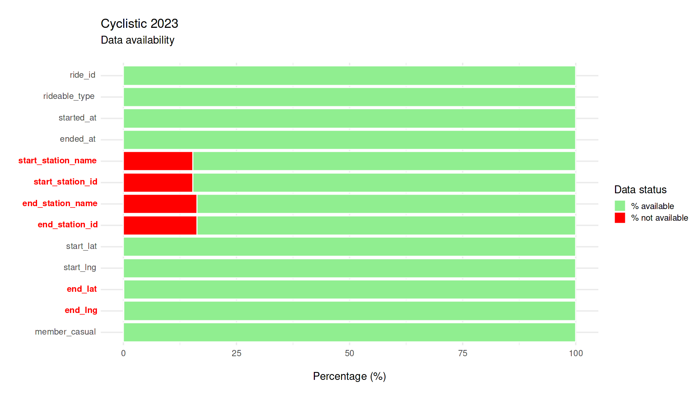

Cyclistic 2023 \| Data Processing
================
Lucio Colonna
<br>Last updated: Tuesday September 10, 2024

<br>

[⬅️ **Back to Index**](./README.md)

<br>

# Summary

<br>

<span style="color: #0047AB;">📌 <strong>Missing Data</strong></span>

- Approximately **15%** to **16%** of values are **missing** in the
  start/end station names and start/end station IDs columns
- Around **0.12%** of values are **missing** in the end
  latitude/longitude columns
- All rows containing [empty or NA values](#1-empty-and-na-values) were
  **dropped**

<hr style="border: none; border-top: 1px solid #ccc; margin: 25px 0;">

<span style="color: #0047AB;">📌 <strong>Data
Adjustments</strong></span>

- [Bike type](#2-bike-type): “docked bike” was replaced with “classic
  bike”, as “docked bike” is a legacy term
- [Station names and IDs](#3-names-and-ids-adjustments): filtered out
  entries with specific keywords in station IDs, and cleaned station
  names by removing unwanted characters and prefixes

<hr style="border: none; border-top: 1px solid #ccc; margin: 25px 0;">

<span style="color: #0047AB;">📌 <strong>Data
Consistency</strong></span>

- Ensured **bijective correspondence** between:

  - 1.  [Station IDs VS station names (for both start,
        end)](#4-station-ids-vs-station-names)
  - 2.  [Station IDs/names (for both start, end) VS coordinate
        sets](#5-station-idsnames-vs-coordinates)

  Specifically:

  - for a. –\> the **mode** (most frequent value) of station names/IDs
    was used
  - for b. –\> the **mean** of start/end station coordinates (latitude,
    longitude) was used

- Fixed stations with coordinates showing significant [standard
  deviation](#54-coordinates-with-high-sd)

<hr style="border: none; border-top: 1px solid #ccc; margin: 25px 0;">

<span style="color: #0047AB;">📌 <strong>New features
introduced</strong></span>

- [New features](#7-new-features-introduction) added to the dataframe,
  specifically:
  - **trip duration**, as the difference between end date/time and start
    date/time
  - additional temporal features (based on the start date) such as
    **quarter**, **month**, **day of the week**, and **hour**
  - **weekday vs weekend** rides, **round trips**
  - estimation of trip **distances** and **speed**

<hr style="border: none; border-top: 1px solid #ccc; margin: 25px 0;">

<span style="color: #0047AB;">📌 <strong>Bad data
removed</strong></span>

- [**Trip duration**](#8-trip-duration):
  - Rides with [negative duration](#81-remove-negative-duration-trips)
    were removed
  - Minimum ride duration set to 1 minute, maximum to 1440 minutes (1
    day). Rides outside these thresholds [were
    removed](#82-remove-outliers)
- Rides with [impossible speed](#9-trip-speed) (higher than **20 MPH** /
  **32 km/h**) were removed

<hr style="border: none; border-top: 1px solid #ccc; margin: 25px 0;">

<span style="color: #0047AB;">📌 <strong>Total rows
dropped</strong></span>

- A total of **1,554,444** rows [were
  dropped](#102-total-rows-dropped-during-process-phase) during the
  process phase (**27.18 %** of raw DF)

<br>

## 1. Empty and NA Values

<br>

[⬅️ **Back to Summary**](#summary)

<br>

To evaluate how many rows have empty or NA values, I’m using the
`skim_without_charts` function from the
[**skimr**](https://cran.r-project.org/web/packages/skimr/skimr.pdf)
library which is very useful to obtain information from the dataset.

Next, I’m selecting specific columns such as `skim_variable` (name of
variable), `n_missing` (NA values count), and `character.empty` (empty
values count).

Then, I’m creating new columns `total_empty_or_NA`,
`percentage_missing`, and `percentage_available` to add some useful
information on data availability.

``` r
skimmer <- skim_without_charts(df) %>%
    select(skim_variable, n_missing, character.empty) %>%
    rename(`NA` = n_missing, empty = character.empty) %>%
    mutate(class = skim_without_charts(df)$skim_type, empty = if_else(is.na(empty),
        0, empty), `NA` = if_else(is.na(`NA`), 0, `NA`), total_empty_or_NA = `NA` +
        empty, total_available = nrow(df) - total_empty_or_NA,
        percentage_not_available = round(total_empty_or_NA/nrow(df) *
            100, 2), percentage_available = 100 - percentage_not_available) %>%
    select(skim_variable, class, total_available, everything()) %>%
    arrange(factor(skim_variable, levels = colnames(df)))

kableExtra::kable(skimmer)
```
<br>

| skim_variable      | class     | total_available |   NA |  empty | total_empty_or_NA | percentage_not_available | percentage_available |
|:-------------------|:----------|----------------:|-----:|-------:|------------------:|-------------------------:|---------------------:|
| ride_id            | character |         5719877 |    0 |      0 |                 0 |                     0.00 |               100.00 |
| rideable_type      | character |         5719877 |    0 |      0 |                 0 |                     0.00 |               100.00 |
| started_at         | character |         5719877 |    0 |      0 |                 0 |                     0.00 |               100.00 |
| ended_at           | character |         5719877 |    0 |      0 |                 0 |                     0.00 |               100.00 |
| start_station_name | character |         4844161 |    0 | 875716 |            875716 |                    15.31 |                84.69 |
| start_station_id   | character |         4844029 |    0 | 875848 |            875848 |                    15.31 |                84.69 |
| end_station_name   | character |         4790675 |    0 | 929202 |            929202 |                    16.25 |                83.75 |
| end_station_id     | character |         4790534 |    0 | 929343 |            929343 |                    16.25 |                83.75 |
| start_lat          | numeric   |         5719877 |    0 |      0 |                 0 |                     0.00 |               100.00 |
| start_lng          | numeric   |         5719877 |    0 |      0 |                 0 |                     0.00 |               100.00 |
| end_lat            | numeric   |         5712887 | 6990 |      0 |              6990 |                     0.12 |                99.88 |
| end_lng            | numeric   |         5712887 | 6990 |      0 |              6990 |                     0.12 |                99.88 |
| member_casual      | character |         5719877 |    0 |      0 |                 0 |                     0.00 |               100.00 |

<br>

<p align="center">
  
</p>

<br>

> Well, results are quite disappointing 😥: <br>
>
> - Between **~15% and ~16%** of values on `start_station_name`,
>   `start_station_id`, `end_station_name` and `end_station_id` are
>   empty Also we have some NA values in the `end_lat` and `end_lng`
>   columns
>
> - If this was a project in the real world, I would (have to 😕)
>   interface with the **relevant stakeholders** to understand what is
>   happening here
>
> - Since this is not the real world, I would happily **drop rows** that
>   contain empty or NA values, but please note that this is not a
>   practice to be taken lightly

<br>

---

<br>


First, I’m replacing any empty strings with NA values across the entire
data frame. Then, I’m dropping any rows that contain missing values,
leaving me with a cleaned-up version of the original data frame.

``` r
df <- df %>%
    replace(., . == "", NA) %>%
    drop_na()

# Re-examine the size of the cleaned dataframe
dim(df)
```

    ## [1] 4331707      13

------------------------------------------------------------------------

Let’s find out how many rows we have dropped:

``` r
rows_dropped_empty_NA_rows <- original_df_rows - nrow(df)
paste0("Rows dropped due to NA or empty values: ", comma(rows_dropped_empty_NA_rows),
    " (", round(rows_dropped_empty_NA_rows * 100/original_df_rows,
        2), "% of raw dataframe)")
```

    ## [1] "Rows dropped due to NA or empty values: 1,388,170 (24.27% of raw dataframe)"

<br>

## 2. Bike type

<br>

[⬅️ **Back to Summary**](#summary)

<br>

Let’s examine the different bike types that appear in the DF:

``` r
unique(df$rideable_type)
```

    ## [1] "electric_bike" "classic_bike"  "docked_bike"

I’ve discovered through online research that “classic bikes” and “docked
bikes” refer to the same type of bike.

Considering this, I’ll update the `rideable_type` column in the dataset
by replacing `docked_bike` with `classic_bike`.

``` r
df <- df %>%
    mutate(rideable_type = if_else(rideable_type == "docked_bike",
        "classic_bike", rideable_type))

unique(df$rideable_type)  # check if replace was succesful
```

    ## [1] "electric_bike" "classic_bike"

<br>

## 3. Names and IDs adjustments

<br>

[⬅️ **Back to Summary**](#summary)

<br>

Some station names and IDs refer to **test and/or charging stations**
and therefore they must be eliminated, as they are not relevant to the
analysis. Also, I want to **standardize** some names to ensure
consistency in the DF (e.g. stations whose names start with “Public
Rack” or stations with asterisks in their name).

To achieve this, I am using the
[**stingr**](https://evoldyn.gitlab.io/evomics-2018/ref-sheets/R_strings.pdf)
library, which is very useful for searching and modifying strings using
regular expressions:

``` r
nrow_before_filtering_id_names <- nrow(df)
```

``` r
df <- df %>%
  filter(
    # Filter out station IDs that include "chargingstx" in their name
    !str_detect(start_station_id, "chargingstx") &
    !str_detect(end_station_id, "chargingstx") &
    
    # Filter out station IDs that include "test", "testing", or "repair"
    !str_detect(start_station_id, regex("test|testing|repair", ignore_case = TRUE)) &
    !str_detect(end_station_id, regex("test|testing|repair", ignore_case = TRUE)) &
    
    # Filter out station names that include "test", "testing", or "repair"
    !str_detect(start_station_name, regex("test|testing|repair", ignore_case = TRUE)) &
    !str_detect(end_station_name, regex("test|testing|repair", ignore_case = TRUE))
  ) %>%

  mutate(
    # Remove parentheses and included text at the end of station names
    start_station_name = str_replace(start_station_name, " \\s*\\(.*\\)$", ""),
    end_station_name = str_replace(end_station_name, " \\s*\\(.*\\)$", ""),
    
    # Remove asterisks from station names
    start_station_name = str_replace(start_station_name, "\\*$", ""),
    end_station_name = str_replace(end_station_name, "\\*$", ""),
    
    # Remove prefix "Public Rack - " from station names
    start_station_name = str_replace(start_station_name, "^Public Rack - ", ""),
    end_station_name = str_replace(end_station_name, "^Public Rack - ", "")
  )
```

Let’s see how many rows we have dropped due to inconsistent names:

``` r
rows_dropped_bad_names <- nrow_before_filtering_id_names - nrow(df)
paste0("Rows dropped due bad IDs/names: ", comma(rows_dropped_bad_names),
    " (", round(rows_dropped_bad_names * 100/original_df_rows,
        2), "% of raw dataframe)")
```

    ## [1] "Rows dropped due bad IDs/names: 78,388 (1.37% of raw dataframe)"

<br>

## 4. Station IDs VS Station Names

<br>

[⬅️ **Back to Summary**](#summary)

<br>

I now want to find out if there is a **bijective correspondence**
between Station IDs and Station names.<br> To achieve this, first of all
I am combining the start and end station IDs and names from the
dataframe into a new dataframe called `all_stations`.

This will allow me to analyze the relationship between station IDs and
names across all trips.

``` r
all_stations <- bind_rows(select(df, station_id = start_station_id,
    station_name = start_station_name), select(df, station_id = end_station_id,
    station_name = end_station_name))

head(all_stations)
```

    ##     station_id                  station_name
    ## 1 TA1309000058   Lincoln Ave & Fullerton Ave
    ## 2 TA1309000037         Kimbark Ave & 53rd St
    ## 3       RP-005        Western Ave & Lunt Ave
    ## 4 TA1309000037         Kimbark Ave & 53rd St
    ## 5 TA1309000037         Kimbark Ave & 53rd St
    ## 6 TA1309000019 Lakeview Ave & Fullerton Pkwy

<br>

------------------------------------------------------------------------

<br>

### 4.1 Problems statement

<br>

[⬅️ **Back to Summary**](#summary)

<br>

I now want to determine:

- How many IDs have multiple station names?
- How many station names have multiple IDs?

I will create a checking function called `check_problems_stations` that
I will invoke again after making any interventions to verify if I have
resolved the issues.

``` r
check_problems_stations <- function(dataframe) {
    by_station_id <- dataframe %>%
        group_by(station_id, station_name) %>%
        summarise(count = n()) %>%
        filter(n() > 1) %>%
        arrange(station_id, desc(count))

    by_station_name <- dataframe %>%
        group_by(station_name, station_id) %>%
        summarise(count = n()) %>%
        filter(n() > 1) %>%
        arrange(station_name, desc(count))

    problem_check <- data.frame(Problem = c("Problem #1", "Problem #2"),
        Description = c("IDs with multiple station names", "Station names with multiple IDs"),
        Total = c(length(unique(by_station_id$station_id)), length(unique(by_station_name$station_name))))

    return(problem_check)
}

check_problems_stations(all_stations)
```

    ##      Problem                     Description Total
    ## 1 Problem #1 IDs with multiple station names    74
    ## 2 Problem #2 Station names with multiple IDs    31

<br>

------------------------------------------------------------------------

<br>

### 4.2 Solve Problem \#1

<br>

[⬅️ **Back to Summary**](#summary)

<br>

To solve problem \#1 (IDs with multiple station names), I will take the
following steps:

1.  calculate the `Mode` (most frequent station name) for each station
    ID
2.  join this mode mapping data with the original df twice, first (i)
    for the start station IDs and then (ii) for the end station IDs
3.  update the `start_station_name` and `end_station_name` columns with
    the mode station names where available, using the `coalesce`
    function to prioritize the mode station names over the original ones

The `coalesce` function selects the first non-null value from a list of
arguments. So, in this context, it selects the mode station name if
available, otherwise keeps the original station name.

``` r
mode_stations <- all_stations %>%
    group_by(station_id) %>%
    summarise(station_name = Mode(station_name))

# Update DF
df <- df %>%
    left_join(mode_stations, by = c(start_station_id = "station_id")) %>%
    rename(start_station_name_mode = station_name) %>%
    left_join(mode_stations, by = c(end_station_id = "station_id")) %>%
    rename(end_station_name_mode = station_name) %>%
    mutate(start_station_name = coalesce(start_station_name_mode,
        start_station_name), end_station_name = coalesce(end_station_name_mode,
        end_station_name)) %>%
    select(-start_station_name_mode, -end_station_name_mode)
```

<br>

------------------------------------------------------------------------

<br>

### 4.3 Solve Problem \#2

<br>

[⬅️ **Back to Summary**](#summary)

<br>

To solve problem \#2 (Station names with multiple IDs), I will take the
same approach applied as in problem \#1:

1.  calculate the `Mode` (most frequent station ID) for each station
    name
2.  join this mode mapping data with the original df twice, first (i)
    for the start station names and then (ii) for the end station names
3.  update the `start_station_id` and `end_station_id` columns with the
    mode station names where available, using the `coalesce` function to
    prioritize the mode station IDs over the original ones

``` r
mode_ids <- all_stations %>%
    group_by(station_name) %>%
    summarise(station_id = Mode(station_id))

# Update DF
df <- df %>%
    left_join(mode_ids, by = c(start_station_name = "station_name")) %>%
    rename(start_station_id_mode = station_id) %>%
    left_join(mode_ids, by = c(end_station_name = "station_name")) %>%
    rename(end_station_id_mode = station_id) %>%
    mutate(start_station_id = coalesce(start_station_id_mode,
        start_station_id), end_station_id = coalesce(end_station_id_mode,
        end_station_id)) %>%
    select(-start_station_id_mode, -end_station_id_mode)
```

<br>

------------------------------------------------------------------------

<br>

### 4.4 Verify problems resolution

<br>

[⬅️ **Back to Summary**](#summary)

<br>

Let’s now verify if the steps taken previously have solved the issues.

We’ll do this by invoking the `check_problem_stations` function again.
However, this time, I’ll provide the `all_stations_updated` dataframe as
an argument, which reflects the updated data within our DF.

``` r
all_stations_updated <- bind_rows(select(df, station_id = start_station_id,
    station_name = start_station_name), select(df, station_id = end_station_id,
    station_name = end_station_name))

check_problems_stations(all_stations_updated)
```

    ##      Problem                     Description Total
    ## 1 Problem #1 IDs with multiple station names     0
    ## 2 Problem #2 Station names with multiple IDs     0

It looks like there is now a bijective correspondence between station
IDs and station names! We can move to the next task.

<br>

## 5. Station IDs/Names VS Coordinates

<br>

[⬅️ **Back to Summary**](#summary)

<br>

I want now to make sure that there is a bijective correspondence between
station IDs / names and sets of coordinates.

To achieve this, I am going to combining the start/end station IDs,
names and start/end latitude and longitude from the dataframe into a new
dataframe called `all_coords`.

``` r
all_coords <- df %>%
    select(station_id = start_station_id, station_name = start_station_name,
        lat = start_lat, lng = start_lng) %>%
    bind_rows(df %>%
        select(station_id = end_station_id, station_name = end_station_name,
            lat = end_lat, lng = end_lng))
```

This time I reckon that it is more appropriate to use the `mean` of
coordinates for each station, in order to identify a unique set.

In order to find the average coordinates for each station, I’m creating
a new dataframe called `all_coords_mean` by further processing
`all_coords`, where I group the data by `station_id` and `station_name`
and then I calculate the mean latitude and longitude for each group.

``` r
all_coords_mean <- all_coords %>%
    group_by(station_id, station_name) %>%
    summarise(mean_lat = mean(lat), mean_lng = mean(lng))

head(all_coords_mean)
```

    ## # A tibble: 6 × 4
    ## # Groups:   station_id [6]
    ##   station_id station_name                     mean_lat mean_lng
    ##   <chr>      <chr>                               <dbl>    <dbl>
    ## 1 021320     MTV Hubbard St                       41.9    -87.7
    ## 2 1011       Fullerton Ave & Narragansett Ave     41.9    -87.8
    ## 3 1012       Langley Ave & 49th St                41.8    -87.6
    ## 4 1015       Peterson Ave & Drake Ave             42.0    -87.7
    ## 5 1016       Peterson Ave & Bernard Ave           42.0    -87.7
    ## 6 1017       Foster Ave & Drake Ave               42.0    -87.7

<br>

------------------------------------------------------------------------

<br>

### 5.1 Problems statement

<br>

[⬅️ **Back to Summary**](#summary)

<br>

I now want to determine:

- How many ID have multiple sets of coordinates?
- How many sets of coordinates have multiple IDs?

Similarly to what I have done before, I will create a checking function
called `check_problems_coords` that I will invoke again after making any
interventions to verify if I have resolved the issues.

``` r
check_problems_coords <- function(dataframe) {
    check_by_station_id <- dataframe %>%
        mutate(conc_coordinates = paste(mean_lat, mean_lng, sep = ", ")) %>%
        group_by(station_id) %>%
        filter(n() > 1)

    check_by_conc_coordinates <- dataframe %>%
        mutate(conc_coordinates = paste(mean_lat, mean_lng, sep = ", ")) %>%
        group_by(conc_coordinates) %>%
        filter(n() > 1)

    problem_check_coords <- data.frame(Problem = c("Problem #3",
        "Problem #4"), Description = c("IDs with multiple sets of coordinates",
        "Sets of coordinates with multiple IDs"), Total = c(length(unique(check_by_station_id$station_id)),
        length(unique(check_by_conc_coordinates$conc_coordinates))))

    return(problem_check_coords)
}

check_problems_coords(all_coords_mean)
```

    ##      Problem                           Description Total
    ## 1 Problem #3 IDs with multiple sets of coordinates     0
    ## 2 Problem #4 Sets of coordinates with multiple IDs     2

<br>

------------------------------------------------------------------------

<br>

### 5.2 Solve Problem \#3

<br>

[⬅️ **Back to Summary**](#summary)

<br>

N/A

It seems that each station ID already has a unique set of coordinates,
so there’s no need to address problem \#3.

<br>

------------------------------------------------------------------------

<br>

### 5.3 Solve Problem \#4

<br>

[⬅️ **Back to Summary**](#summary)

<br>

It seems that 2 sets of coordinates are assigned to more than one
Station ID. To identify these cases, I’m grouping by concatenated
coordinates, and filtering instances where there are multiple station
IDs associated with the same set of coordinates.

``` r
all_coordinates_check_02 <- all_coords_mean %>%
    mutate(conc_coordinates = paste(mean_lat, mean_lng, sep = ", ")) %>%
    group_by(conc_coordinates) %>%
    filter(n() > 1)

print(all_coordinates_check_02)
```

    ## # A tibble: 4 × 5
    ## # Groups:   conc_coordinates [2]
    ##   station_id station_name              mean_lat mean_lng conc_coordinates
    ##   <chr>      <chr>                        <dbl>    <dbl> <chr>           
    ## 1 526        Legler Regional Library       41.9    -87.7 41.88, -87.73   
    ## 2 853        Keeler Ave & Madison St S     41.9    -87.7 41.88, -87.73   
    ## 3 899        Longwood Dr & 111th St        41.7    -87.7 41.69, -87.67   
    ## 4 901        Hale Ave & 111th St           41.7    -87.7 41.69, -87.67

Let’s see how many rides correspond to those station IDs:

``` r
duplicated_coordinates <- df %>%
    filter(start_station_id %in% c(526, 853, 899, 901) | end_station_id %in%
        c(526, 853, 899, 901)) %>%
    summarize(n_rows = n()) %>%
    pull(n_rows)

duplicated_coordinates
```

    ## [1] 11

Due to the lack of sufficient information to reallocate coordinates in
these instances, and considering the minimal number of rides linked to
those station IDs (11 in total), I’ve decided to remove those lines from
the dataset

``` r
df <- df %>%
    filter(!start_station_id %in% c(526, 853, 899, 901), !end_station_id %in%
        c(526, 853, 899, 901))
```

<br>

------------------------------------------------------------------------

<br>

### 5.4 Coordinates with high SD

<br>

[⬅️ **Back to Summary**](#summary)

<br>

Before continuing, I intend to check if there are stations with
significant variations in their coordinates. These variations could
potentially affect the accuracy of their representation on maps during
the analysis phase.

In order to do this, I’m calculating the standard deviation (SD) of
latitude and longitude for each station, filtering the results to
identify where either the latitude or longitude SD is higher than 1.

``` r
high_sd <- all_coords %>%
    group_by(station_id, station_name) %>%
    summarise(dev_lat = sd(lat), dev_lng = sd(lng)) %>%
    filter(dev_lat > 1 | dev_lng > 1)

print(high_sd)
```

    ## # A tibble: 1 × 4
    ## # Groups:   station_id [1]
    ##   station_id station_name               dev_lat dev_lng
    ##   <chr>      <chr>                        <dbl>   <dbl>
    ## 1 653B       Stony Island Ave & 63rd St    1.67    3.50

Luckily, only 1 station is affected by this issue. Let’s see how many
rides correspond to that station ID:

``` r
df %>%
    filter(start_station_id == "653B" | end_station_id == "653B") %>%
    summarize(n_rows = n()) %>%
    pull(n_rows)
```

    ## [1] 585

In this case, the number of rides associated to this station is too high
to be dropped, therefore I am going to hardcode the coordinates in the
DF, to make sure that they are consistent:

``` r
# New cooords values
new_lat <- 41.78
new_lng <- -87.59

df <- df %>%
    mutate(start_lat = if_else(start_station_id == "653B", new_lat,
        start_lat), start_lng = if_else(start_station_id == "653B",
        new_lng, start_lng), end_lat = if_else(end_station_id ==
        "653B", new_lat, end_lat), end_lng = if_else(end_station_id ==
        "653B", new_lng, end_lng))
```

<br>

------------------------------------------------------------------------

<br>

### 5.5 Verify problems resolution

<br>

[⬅️ **Back to Summary**](#summary)

<br>

Let’s now verify if the actions taken above have solved the problems:

``` r
all_coords_mean_update <- df %>%
    select(station_id = start_station_id, station_name = start_station_name,
        lat = start_lat, lng = start_lng) %>%
    bind_rows(df %>%
        select(station_id = end_station_id, station_name = end_station_name,
            lat = end_lat, lng = end_lng)) %>%
    group_by(station_id, station_name) %>%
    summarise(mean_lat = mean(lat), mean_lng = mean(lng))

check_problems_coords(all_coords_mean_update)
```

    ##      Problem                           Description Total
    ## 1 Problem #3 IDs with multiple sets of coordinates     0
    ## 2 Problem #4 Sets of coordinates with multiple IDs     0

It looks like all problems are solved, therefore we can now update the
DF:

``` r
all_coords_mean_update_clean <- all_coords_mean_update %>%
    select(station_id, mean_lat, mean_lng)

df <- df %>%
    left_join(all_coords_mean_update_clean, by = c(start_station_id = "station_id")) %>%
    rename(start_lat_mean = mean_lat, start_lng_mean = mean_lng) %>%
    left_join(all_coords_mean_update_clean, by = c(end_station_id = "station_id")) %>%
    rename(end_lat_mean = mean_lat, end_lng_mean = mean_lng) %>%
    mutate(start_lat = start_lat_mean, start_lng = start_lng_mean,
        end_lat = end_lat_mean, end_lng = end_lng_mean) %>%
    select(-start_lat_mean, -start_lng_mean, -end_lat_mean, -end_lng_mean)
```

<br>

## 6. Additional checks

<br>

[⬅️ **Back to Summary**](#summary)

<br>

I now want to check if there any other unpleasant surprises in my
DF.<br> Specifically, I want to: - check if there are any duplications
in the `ride_id` column - verify that `member_casual` column contains
only the values `member` and `casual`

``` r
sum(duplicated(df$ride_id))
```

    ## [1] 0

``` r
unique(df$member_casual)
```

    ## [1] "member" "casual"

Looks like everything is ok (some good news at last!), therefore we can
proceed to the next task.

<br>

## 7. New features introduction

<br>

[⬅️ **Back to Summary**](#summary)

<br>

I am now adding new features to the DF, which will be useful for later
analysis.

For this task, I will leverage on the functionalities of the
[**lubridate**](https://evoldyn.gitlab.io/evomics-2018/ref-sheets/R_lubridate.pdf)
and
[**geosphere**](https://cran.r-project.org/web/packages/geosphere/geosphere.pdf)
libraries.

Specifically I will: 
- Convert the columns `started_at` and `ended_at`
into `POSIXct` (date-time) format
- Calculate trip durations as the
difference between `ended_at` and `started_at` columns
- Derive additional temporal features (based on the `started_at` column) such as
quarter, month, day of the week, and hour
- Implement features to distinguish whether a trip occurred on a weekday or weekend, and to
identify round trips by comparing start and end station IDs
- Provide estimation of trip distances and speed

``` r
df <- df %>%
    mutate(started_at = as.POSIXct(started_at, format = "%Y-%m-%d %H:%M:%S",
        tz = "UTC"), ended_at = as.POSIXct(ended_at, format = "%Y-%m-%d %H:%M:%S",
        tz = "UTC"), duration_minutes = as.numeric(round((ended_at -
        started_at)/60, 2)), quarter_name = factor(case_when(quarter(started_at) ==
        1 ~ "1st Quarter", quarter(started_at) == 2 ~ "2nd Quarter",
        quarter(started_at) == 3 ~ "3rd Quarter", quarter(started_at) ==
            4 ~ "4th Quarter"), levels = c("1st Quarter", "2nd Quarter",
        "3rd Quarter", "4th Quarter")), month_name = factor(month.abb[month(started_at)],
        levels = month.abb), day_of_week_name = factor(wday(started_at,
        label = TRUE, abbr = TRUE, week_start = 1, locale = "en_US.UTF-8")),
        hour_of_day = hour(started_at), weekend = ifelse(day_of_week_name %in%
            c("Sat", "Sun"), "Weekend", "Monday to Friday"),
        round_trip = if_else(start_station_id == end_station_id,
            TRUE, FALSE), trip_distance_km = distGeo(cbind(start_lng,
            start_lat), cbind(end_lng, end_lat))/1000, trip_speed_kmph = round(trip_distance_km/duration_minutes *
            60, 2), member_casual = factor(member_casual, levels = c("casual",
            "member"))  # modify existing feature
)
```

Let’s check the updated df:

``` r
glimpse(df)
```

    ## Rows: 4,253,308
    ## Columns: 22
    ## $ ride_id            <chr> "F96D5A74A3E41399", "13CB7EB698CEDB88", "BD88A2E670…
    ## $ rideable_type      <chr> "electric_bike", "classic_bike", "electric_bike", "…
    ## $ started_at         <dttm> 2023-01-21 20:05:42, 2023-01-10 15:37:36, 2023-01-…
    ## $ ended_at           <dttm> 2023-01-21 20:16:33, 2023-01-10 15:46:05, 2023-01-…
    ## $ start_station_name <chr> "Lincoln Ave & Fullerton Ave", "Kimbark Ave & 53rd …
    ## $ start_station_id   <chr> "TA1309000058", "TA1309000037", "RP-005", "TA130900…
    ## $ end_station_name   <chr> "Hampden Ct & Diversey Ave", "Greenwood Ave & 47th …
    ## $ end_station_id     <chr> "202480.0", "TA1308000002", "599", "TA1308000002", …
    ## $ start_lat          <dbl> 41.92416, 41.79957, 42.00857, 41.79957, 41.79957, 4…
    ## $ start_lng          <dbl> -87.64638, -87.59474, -87.69046, -87.59474, -87.594…
    ## $ end_lat            <dbl> 41.93188, 41.80983, 42.03973, 41.80983, 41.80983, 4…
    ## $ end_lng            <dbl> -87.64191, -87.59937, -87.69942, -87.59937, -87.599…
    ## $ member_casual      <fct> member, member, casual, member, member, member, mem…
    ## $ duration_minutes   <dbl> 10.85, 8.48, 13.23, 8.77, 15.32, 3.22, 14.00, 9.35,…
    ## $ quarter_name       <fct> 1st Quarter, 1st Quarter, 1st Quarter, 1st Quarter,…
    ## $ month_name         <fct> Jan, Jan, Jan, Jan, Jan, Jan, Jan, Jan, Jan, Jan, J…
    ## $ day_of_week_name   <ord> Sat, Tue, Mon, Sun, Thu, Tue, Sun, Wed, Wed, Fri, T…
    ## $ hour_of_day        <int> 20, 15, 7, 10, 13, 7, 21, 10, 20, 16, 17, 17, 19, 2…
    ## $ weekend            <chr> "Weekend", "Monday to Friday", "Monday to Friday", …
    ## $ round_trip         <lgl> FALSE, FALSE, FALSE, FALSE, FALSE, FALSE, FALSE, FA…
    ## $ trip_distance_km   <dbl> 0.9344032, 1.2025276, 3.5405369, 1.2025276, 1.20252…
    ## $ trip_speed_kmph    <dbl> 5.17, 8.51, 16.06, 8.23, 4.71, 13.26, 5.15, 7.72, 5…

<br>

## 8. Trip duration

<br>

[⬅️ **Back to Summary**](#summary)

<br>

Now I aim to explore the duration of the trips to identify if there are
any anomalies:

``` r
summary(df$duration_minutes)
```

    ##    Min. 1st Qu.  Median    Mean 3rd Qu.    Max. 
    ##  -54.57    5.62    9.78   15.94   17.48 6891.22

The `summary` function shows that there are some negative values in trip
duration, which naturally cannot be possible. Therefore, I will be
dropping those lines (also in this case it should be appropriate to
discuss the matter with the relevant stakeholders).

------------------------------------------------------------------------

### 8.1 Remove negative duration trips

<br>

[⬅️ **Back to Summary**](#summary)

<br>

``` r
rows_dropped_negative_duration <- df %>%
    filter(duration_minutes <= 0) %>%
    summarize(n_row = n()) %>%
    pull(n_row)

# Keep only positive durations
df <- subset(df, duration_minutes > 0)

paste0("Rows dropped due to negative duration: ", comma(rows_dropped_negative_duration),
    " (", round(100 * rows_dropped_negative_duration/original_df_rows,
        3), "% of raw dataframe)")
```

    ## [1] "Rows dropped due to negative duration: 550 (0.01% of raw dataframe)"

------------------------------------------------------------------------

### 8.2 Remove outliers

<br>

[⬅️ **Back to Summary**](#summary)

<br>

The result of `summary` function for `duration_minutes` above suggests a
wide range of ride durations, with potential outliers at both ends of
the spectrum.

To identify outliers, we could apply different methodologies such as
Tukey’s fences or z-score (spoiler alert: they both don’t yield results
that I find acceptable for this case study). Alternatively, we could
employ common sense and industry knowledge.

What constitutes too little and too much for a bike ride?

Quite arbitrarily, I’ve posited that:<br> - the **minimum duration**
(relevant for this analysis) for a bike sharing ride is **1 minute**.
Rides shorter than this could be due to technical malfunctions, user
changes of mind, unforeseen circumstances (like sudden rain), or perhaps
a desire to test out the service <br> - the **maximum duration** of a
ride (relevant for this analysis) is **1440 minutes** (1 day), which
might align with the 1-day ride pass offered by the company. Rides
exceeding this limit could be attributed to various factors such as
payment issues, theft/loss, or other technical problems

On the basis of above assumptions, I’ll filter the dataframe
accordingly:

``` r
rows_dropped_outliers <- df %>%
    filter(duration_minutes < 1 | duration_minutes > 1440) %>%
    summarise(n_row = n()) %>%
    pull(n_row)

# filter DF
df <- df %>%
    filter(duration_minutes >= 1, duration_minutes <= 1440)

paste0("Rows dropped due to outliers: ", comma(rows_dropped_outliers),
    " (", round(100 * rows_dropped_outliers/original_df_rows,
        2), " % of raw dataframe)")
```

    ## [1] "Rows dropped due to outliers: 85,498 (1.49 % of raw dataframe)"

<br>

## 9. Trip Speed

<br>

[⬅️ **Back to Summary**](#summary)

<br>

``` r
summary(df$trip_speed_kmph)
```

    ##    Min. 1st Qu.  Median    Mean 3rd Qu.    Max. 
    ##    0.00    7.82   10.73   10.54   13.59 1151.89

The `summary` function on `trip_speed_kmph` suggests the presence of
some values that indicate impossible speeds.

According to [**company’s
website**](https://divvybikes.com/HOW-IT-WORKS/EBIKE-temp), the maximum
reachable speed for electric bikes is **20 MPH** (approximately **32
km/h**). Therefore, I will filter out all trips with speeds higher than
32 km/h, to ensure data accuracy:

``` r
rows_dropped_impossible_speed <- df %>%
    filter(trip_speed_kmph > 32) %>%
    summarise(n_row = n()) %>%
    pull(n_row)

# filter Df
df <- subset(df, trip_speed_kmph <= 32)

paste0("Rows dropped due to impossible speed: ", comma(rows_dropped_impossible_speed),
    " (", round(100 * rows_dropped_impossible_speed/original_df_rows,
        2), " % of raw dataframe)")
```

    ## [1] "Rows dropped due to impossible speed: 1,827 (0.03 % of raw dataframe)"

<br>

<br>

## 10. Concluding Activities

<br>

### 10.1 Remove colums not necessary for analysis

<br>

[⬅️ **Back to Summary**](#summary)

<br>

I’ll drop the columns `ride_id`, `started_at` and `ended_at`, as they
will not be needed for the analysis phase:

``` r
df <- df %>%
    select(-ride_id, -started_at, -ended_at)
```

------------------------------------------------------------------------

<br>

### 10.2 Total rows dropped during process phase

<br>

[⬅️ **Back to Summary**](#summary)

<br>

Let’s count how many rows in total were dropped during the whole process
phase and examine the dimension of the df:

``` r
rows_dropped_df <- data.frame(dropping_reason = c("Empty or NA Values",
    "Bad Station IDs/Names", "Duplicated Coordinates", "Negative trip duration",
    "Trip duration outliers", "Impossible speed"), n_rows_dropped = c(rows_dropped_empty_NA_rows,
    rows_dropped_bad_names, duplicated_coordinates, rows_dropped_negative_duration,
    rows_dropped_outliers, rows_dropped_impossible_speed)) %>%
    mutate(percentage_on_raw_DF = percent(n_rows_dropped/original_df_rows))

print(rows_dropped_df)
```

    ##          dropping_reason n_rows_dropped percentage_on_raw_DF
    ## 1     Empty or NA Values        1388170             24.2692%
    ## 2  Bad Station IDs/Names          78388              1.3704%
    ## 3 Duplicated Coordinates             11              0.0002%
    ## 4 Negative trip duration            550              0.0096%
    ## 5 Trip duration outliers          85498              1.4948%
    ## 6       Impossible speed           1827              0.0319%

``` r
rows_dropped_total <- original_df_rows - nrow(df)

paste0("Total rows dropped during the whole data processing phase: ",
    comma(rows_dropped_total), " (", round(100 * rows_dropped_total/original_df_rows,
        2), " % of raw dataframe)")
```

    ## [1] "Total rows dropped during the whole data processing phase: 1,554,444 (27.18 % of raw dataframe)"

``` r
dim(df)
```

    ## [1] 4165433      19

<br>
